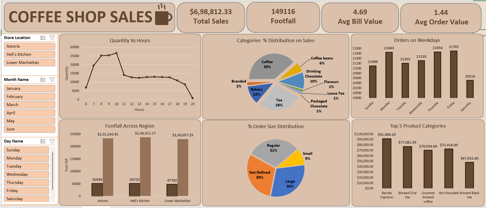

# ☕ Coffee Shop Sales Analysis (Excel Dashboard Project)

This project focuses on analyzing sales data from a coffee shop to derive actionable business insights using **Excel**, **Power Query**, **Measures**, and an interactive **Dashboard**.

## 📊 Overview

The primary goal of this project is to help the coffee shop improve its business performance by uncovering trends and patterns in its sales data.

### 🔍 Key Business Questions Addressed:
- How do sales vary by **day of the week** and **hour of the day**?
- Are there any **peak times** for sales activity?
- What is the **total sales revenue per month**?
- How do sales differ across **store locations**?
- What is the **average order value** per person?
- Which products are **best-selling** by quantity and revenue?
- How do sales vary by **product category and type**?

---
## 📊 DataSet 

🔗 [Download DataSet File](https://mavenanalytics.io/data-playground?page=6&pageSize=5)

 

---
## 📌 Key Findings

- ☕ **Coffee** is the top-selling category, accounting for **39%** of total sales, followed by **Tea (28%)** and **Bakery items (12%)**.
- 🕖 **Peak sales hours** are between **8 AM to 11 AM**, highlighting morning demand.
- 📍 All three store locations—**Astoria**, **Hell's Kitchen**, and **Lower Manhattan**—show balanced performance, each contributing over **$2.3L+ in revenue**.
- 🧾 **Total Sales**: $6,98,812.33  
  **Footfall**: 1,49,116  
  **Avg Bill Value**: $4.69  
  **Avg Order Value**: $1.44
- 🏆 **Top Products** by revenue include:
  - Barista Espresso – $91,406.20
  - Brewed Chai Tea – $77,081.95
  - Gourmet Brewed Coffee – $70,034.60
  - Hot Chocolate – $72,416.00
- 📅 **Friday** saw the highest number of orders, followed closely by **Thursday** and **Monday**.
- 🛍️ Majority of order sizes fall under **Regular (31%)** and **Large (30%)**

---

## 📈 Dashboard Preview

---

## 🛠 Tools & Features Used

| Tool/Feature     | Purpose                                |
|------------------|----------------------------------------|
| Excel            | Data analysis and dashboard creation   |
| Power Query      | ETL (Extract, Transform, Load) process |
| Measures         | Dynamic calculations                   |
| Pivot Tables     | Aggregation and breakdowns             |
| Charts & Graphs  | Visualization of insights              |

---

## 📥 Download Project

🔗 [Download Excel File](https://1drv.ms/x/c/DC852961FE5B10CB/EfaRHxhN4ChPtdmpW-WPUI0BPjo_HdtVvDhcJx-L_lAlgA?e=gMRRn6)

---

## 👤 Author

**Agamjot Singh**  
_Data Analyst _

